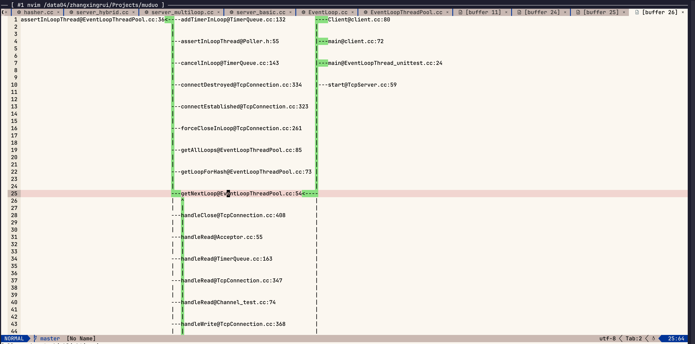
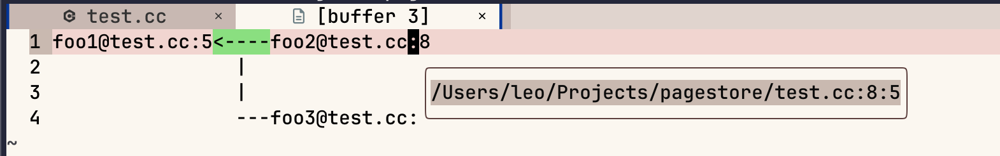
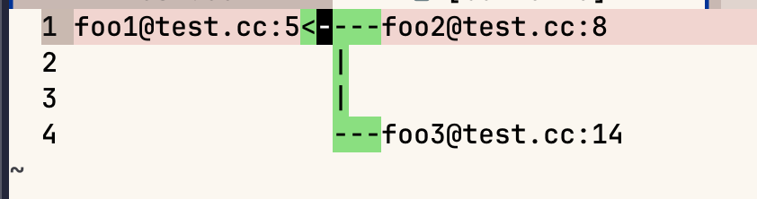
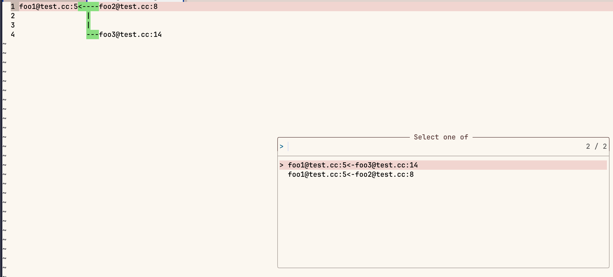

# call-graph.nvim

受[Sourcetrail](https://github.com/CoatiSoftware/Sourcetrail) 和 [trails.nvim ](https://github.com/kontura/trails.nvim)启发，开发的 interactive ascii call graph插件，用于辅助阅读源码。

> 个人的第一款插件，插件仍处于非常早期的阶段，bug expected，欢迎feedback。

**仅在clangd server上测试通过（因为个人主语言是c++), 理论上所有支持callHierarchy/incomingCalls的lsp server均可使用。**

- pyright server 测试可用，但性能不佳，很不建议使用。 (TODO: 限制search层级)

https://github.com/user-attachments/assets/e6a869d2-21bf-46eb-bf58-e8a81180f60f

# 安装

lazy.nvim

```lua
  {
    "ravenxrz/call-graph.nvim",
    opts = {
      log_level = "info",
      reuse_buf = true,  -- 多次生成的call graph是否复用同一个buf
      auto_toggle_hl = true, -- 是否自动高亮
      hl_delay_ms = 200 -- 自动高亮间隔时间
    }
  }
```

支持的cmd:

- CallGraph: 生成call graph
- CallGraphToggleAutoHighlight: 开关自动高亮
- CallGraphLog:  打开call graph的log

Highlight group:

- CallGraphLine, 默认值link到了Search，可自行修改。

# 功能

以开源项目[muduo](https://github.com/chenshuo/muduo)展示：



图像说明：

1. 每个节点命名格式 function_name@file_name:line_number
2. 每个节点入边为callee, 出边为caller
3. 光标移动到一个节点上，会自动高亮它的所有入边和出边
4. 光标移动到边上，会自动高亮所有和当前光标有重叠边（可能会有多个）
5. 每个节点和边都可以通过快捷键gd,跳转到对应位置
6. 每个节点可以通过快捷键K，显示文件全路径, 如：



7. 多边重合想要跳转时，提供可选窗口：

如下，foo1被foo2和foo3同时调用，光标与两条边都有重叠：



此时跳转会提供选择：



如果想要临时取消自动高亮（注意不会取消高亮，只是取消**自动**），可调用CallGraphToggleAutoHighlight命令，用于当一个节点的caller，callee超过buffer可视范围时，自由开关。

# FAQ

**1. 从call graph跳转到buffer的地方不对或报column out of range**

这可能是neovim或者lsp server的bug，`vim.lsp.buf.incoming_calls` 函数返回值不准，可调用 `:lua vim.lsp.buf.incoming_calls()`确认位置信息返回值。

**2.调用链图不全**

根据 [issue](https://github.com/clangd/clangd/issues/609) 所说，lsp  incomingCalls仅支持分析打开了的文件，所以对于没有打开的文件，可能会缺分析。

解决方案：自行在图上跳转（用于打开文件），然后重新从root node生成调用图。

> 个人实现过自动打开再分析，但是效果太差

# TODO

- 补充ut
